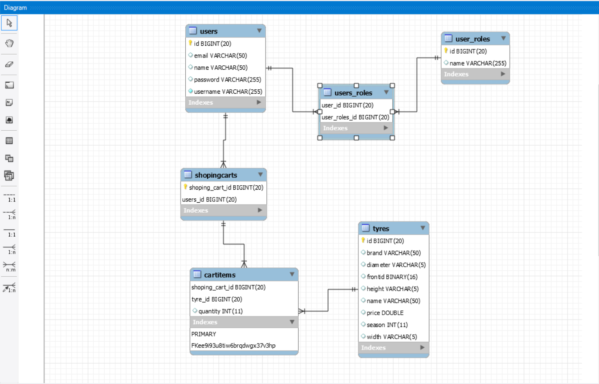

# WebShopForTyres

### This is backend part of the e-commerce web shop for tyres with possibility to search, filter and save desired tyres persistently in own cart. It is written in Java language with Spring framework, and application is linked with [frontend](https://github.com/brankovitorovic/web-shop-for-tyres-frontend) with RESTful API.

#### Backend contains spring security with authentication and authorization achieved thanks to a JWT token generated by the server. Also include endpoints for CRUD operations and search by users, cart or tyres with pagination as needed.

  
How to use

  
#### Download the code and import in desired IDE,then in file src/main/resources/application.properties change parametars for database and run it.

  
Technologies and libraries

   
  
 1. Java with Spring boot framework
 2. MySql database
 3. Lombok library
 4. Javax validation
 5. Mapstruct
 6. Java JWT

  
Database diagram

   
  
  
  

